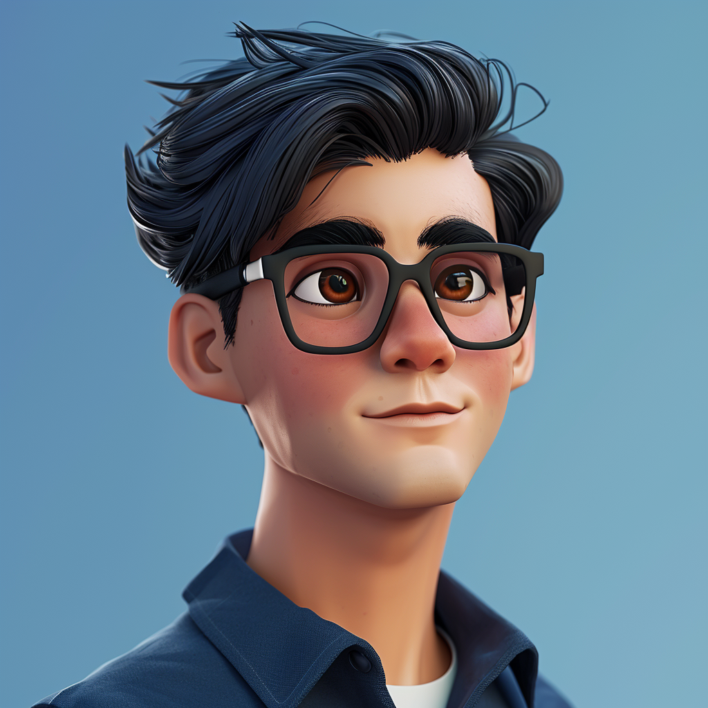
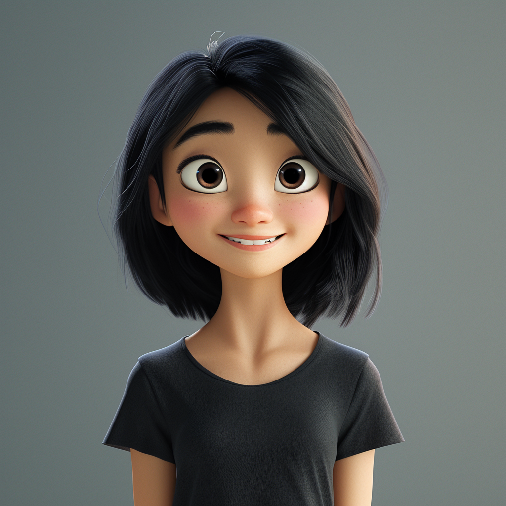
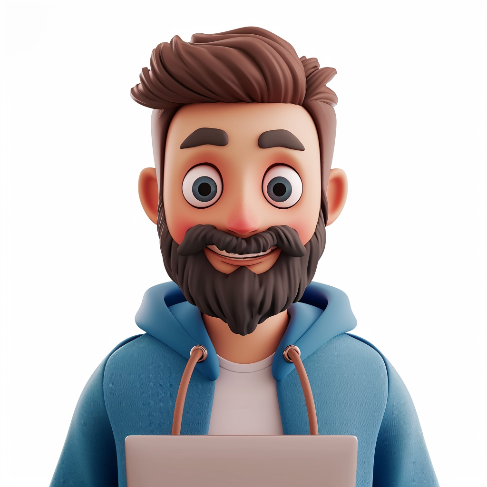
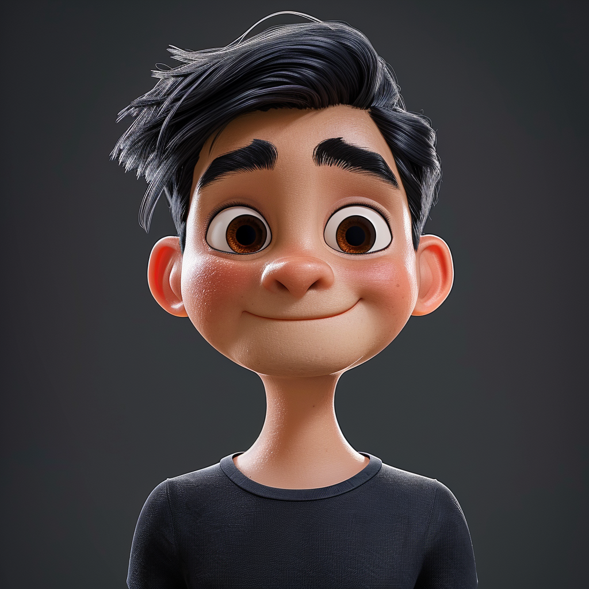

# Team

<figure><figcaption>
<a href="https://www.linkedin.com/in/mike-lempres-b8447214/overlay/about-this-profile/">Mike Lempres</a> - Founder
</figcaption></figure>

<figure><figcaption>
<a href="https://www.linkedin.com/in/najamkidwai/overlay/about-this-profile/">Dr. Najam Kidwai</a> - CO-Founder
</figcaption></figure>

<figure><figcaption>
M<a href="https://www.linkedin.com/in/michael-zhao-38b97b2/overlay/about-this-profile/">ichael Zhao</a>- CEO
</figcaption></figure>

<figure><figcaption>
Benjamin Dubois - CSO
</figcaption></figure>

<figure><figcaption>
Alice Lee - CMO
</figcaption></figure>

<figure><figcaption>
Thomas Schmidt - Head of BD
</figcaption></figure>

<figure><figcaption>
William Takahashi - Senior Software Engineer
</figcaption></figure>

<figure><figcaption>
Caleb Jurchisin - Lead Developer
</figcaption></figure>

<figure><figcaption>
Christopher Hernandez - Visual and Design Lead
</figcaption></figure>
